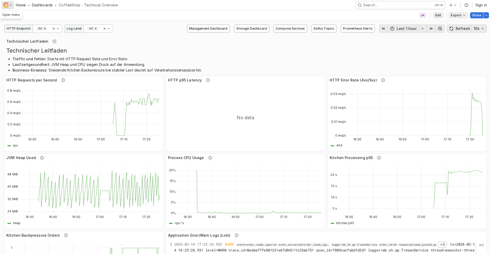
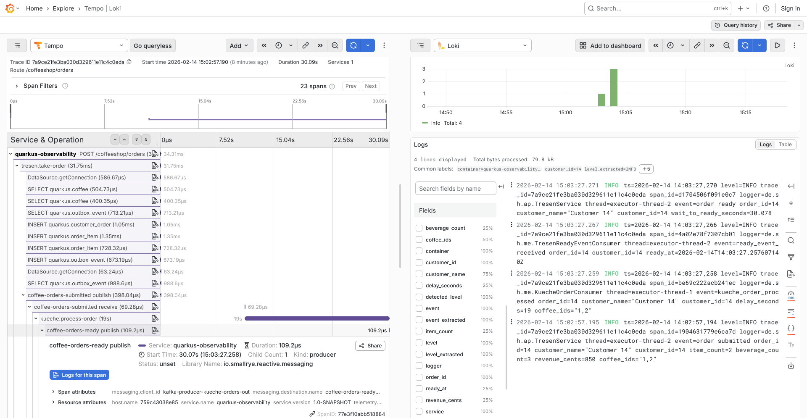

At some point, every project claims "we have monitoring" and what it really means is:

- one dashboard nobody trusts,
- logs without context,
- traces that exist only in slides.

So I decided to spend one long Saturday afternoon building a proper reference implementation in
[`quarkus-observability`](https://github.com/TimSeyschab/quarkus-observability).

The goal was simple: have one repo I can copy from for future projects, and finally understand the full path from request to trace to logs to metrics without hand-wavy gaps.

## What happened in that afternoon

The commit history is basically the diary:

```plaintext
21f0e61 | 2026-02-14 13:43 | Initial commit
 d0668b7 | 2026-02-14 14:00 | feat: add initial CoffeeShop application setup
  6dac0bb | 2026-02-14 17:29 | feat: enhance Grafana dashboards
```

So yes, this started after lunch and ended somewhere between "just one more panel" and "why are there 12 tabs open in Grafana?".

## What I actually built

The stack is local-first with Docker Compose and includes:

- Quarkus app (`app`)
- OTel Collector with tail sampling
- Tempo for traces
- Prometheus for metrics
- Loki + Promtail for logs
- Grafana as central UI
- Redpanda/Kafka + MariaDB for the business flow (CoffeeShop order lifecycle)



## The part that made it click for me

The real win was making correlation explicit instead of accidental:

1. Requests create spans in Quarkus.
2. Spans go via OTLP HTTP to the collector.
3. Collector keeps important traces (errors, slow requests, business endpoints) and down-samples the rest.
4. Logs include `trace_id` and `span_id`.
5. In Grafana, I can jump from trace to logs and back without guessing.

That sampling setup looked roughly like this:

```yaml
- keep-errors
- keep-slow-traces (>= 1000ms)
- keep-business-order-lifecycle (/coffeeshop/orders...)
- sample-technical-q-endpoints (5%)
- sample-fast-normal-traces (10%)
```

And this log format turned out to be non-negotiable:

```properties
quarkus.log.console.format=... trace_id=%X{traceId} span_id=%X{spanId} ...
```

Without those fields, "observability" quickly becomes archaeology.

## Why this became my reference repo

I wanted something practical I can copy into future services, not another "hello telemetry" demo.
So this repo now includes:

- outbox-based event publishing (DB + Kafka flow)
- runbook-style docs and config reference
- working dashboards for technical and management views
- a small load script (`./scripts/load-coffeeshop.sh`) to generate realistic traces quickly

The load script was especially useful because it repeatedly creates and picks up orders, which made it easy to validate end-to-end behavior under repeated flows.

## One screenshot that sums it up

This is the point where it felt "real": opening a trace in Grafana and correlating it with logs.



If it's not observable end-to-end, it doesn't exist yet.

## What I would copy first into other projects

If I had to pick only three things:

1. trace/log correlation (`trace_id`, `span_id` in logs)
2. head + tail sampling strategy (not only one side)
3. a runnable local stack that new teammates can start with one command

Everything else is optimization.

And yes, this started as "just a quick setup".
